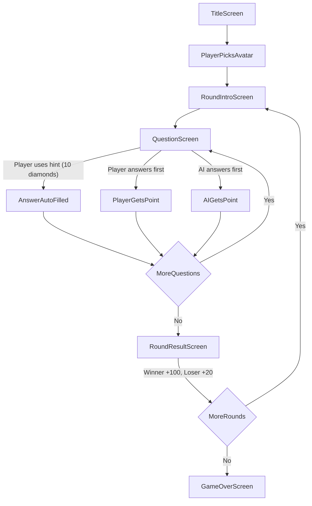

# Harry Potter Trivia Game

## Tech Stack

- **React 18** via Vite (fast scaffolding, no backend needed)
- **Plain CSS** with CSS modules or a single stylesheet (dark, magical theme)
- **No external UI library** -- lightweight, mobile-first

---

## Game Flow



### Screens

1. **Title Screen** -- Game logo, "Start Game" button, magical background.
2. **Avatar Selection** -- Player picks their avatar (any HP character image). Shown once at game start.
3. **Round Intro** -- Shows round number, the AI's new avatar for this round, and a "Begin Round" button.
4. **Question Screen** -- The core gameplay loop (details below).
5. **Round Result** -- Scoreboard for the round: who won, diamonds awarded.
6. **Game Over** -- Final diamond totals, rounds won/lost, winner declaration.

---

## Core Mechanics

### Question Screen

- A question is displayed at the top.
- Below it: a text input for the player to type their answer + a "Submit" button.
- A visible **countdown timer** (e.g. 15 seconds per question).
- The **AI "types" its answer** after a random delay (3-10 seconds). The AI answer appears letter-by-letter in a separate box to simulate typing, then auto-submits.
- **Whoever submits a correct answer first wins the question.** If the player submits an incorrect answer, the AI still has a chance (and vice versa). If neither is correct, no point is awarded.
- Answer matching is **case-insensitive** and uses fuzzy matching (Levenshtein distance or acceptable-answers list) to handle typos/alternate spellings.

### Hint System

- A "Use Hint (10 diamonds)" button is visible on the question screen.
- When used: the answer is revealed and auto-submitted for the player, awarding them the point. The AI does not answer that question.
- If the player has fewer than 10 diamonds, the button is disabled/grayed out.

### Diamond Economy

- **Round winner**: +100 diamonds
- **Round loser**: +20 diamonds
- **Starting diamonds**: 50 (so the player can afford hints early)
- Hint cost: 10 diamonds per use

### AI Behavior

- The AI answers correctly ~70% of the time (randomized per question) to keep the game competitive but beatable.
- AI response delay is randomized: 3-10 seconds.
- When the AI "gets it wrong," it submits a plausible but incorrect answer.

---

## AI Avatars (per round, in order)

| Round | AI Avatar |
|-------|-----------|
| 1 | Draco Malfoy |
| 2 | George Weasley |
| 3 | Fred Weasley |
| 4 | Mr. Weasley |
| 5 | Professor McGonagall |
| 6 | Mrs. Weasley |
| 7 | Remus Lupin |
| 8 | Lily Potter |
| 9 | James Potter |
| 10 | Hagrid |
| 11 | Voldemort |
| 12 | Albus Dumbledore |
| 13 | Ron Weasley |
| 14 | Hermione Granger |
| 15 | Harry Potter |

Avatar images will be stylized initials/emoji-based icons rendered with CSS (no external image assets needed), or we can use a free avatar API. Each avatar gets a unique color and styled initial.

---

## All 75 Questions (15 Rounds x 5 Questions)

### Round 1 -- Draco Malfoy (Slytherin Basics)
1. What Hogwarts house is Draco Malfoy in? **Slytherin**
2. What is the name of Draco's father? **Lucius Malfoy** (accept: Lucius)
3. What is the name of the Malfoy family's house-elf? **Dobby**
4. What animal does Draco get turned into by Mad-Eye Moody? **Ferret** (accept: white ferret)
5. What broomstick does Draco's father buy for the Slytherin team? **Nimbus 2001**

### Round 2 -- George Weasley (Weasley Twins and Jokes)
1. What is the name of the map Fred and George give to Harry? **Marauder's Map** (accept: The Marauder's Map)
2. What shop do Fred and George open in Diagon Alley? **Weasleys' Wizard Wheezes** (accept: Weasley Wizard Wheezes)
3. What product do Fred and George use to age themselves for the Goblet of Fire? **Aging Potion**
4. What ear does George lose in the Battle of the Seven Potters? **Left ear** (accept: left)
5. What form does George's Patronus take? **Magpie**

### Round 3 -- Fred Weasley (Hogwarts Mischief)
1. In which battle does Fred Weasley die? **Battle of Hogwarts**
2. What position did Fred play on the Gryffindor Quidditch team? **Beater**
3. What are Fred and George's Skiving Snackboxes designed to do? **Make you ill** (accept: get out of class, skip class, fake illness)
4. Who does Fred take to the Yule Ball? **Angelina Johnson** (accept: Angelina)
5. What magical item causes a massive swamp in a Hogwarts corridor? **Portable Swamp**

### Round 4 -- Mr. Weasley (Ministry of Magic)
1. What is the name of the Weasley family home? **The Burrow** (accept: Burrow)
2. What enchanted car does Arthur own? **Ford Anglia** (accept: flying Ford Anglia)
3. What snake attacks Arthur Weasley at the Ministry? **Nagini**
4. What Muggle object is Arthur Weasley fascinated by? **Rubber duck** (accept: rubber ducks, plugs -- multiple acceptable)
5. What department does Arthur Weasley work in at the Ministry? **Misuse of Muggle Artifacts** (accept: Misuse of Muggle Artefacts Office)

### Round 5 -- Professor McGonagall (Transfiguration and Hogwarts)
1. What subject does McGonagall teach? **Transfiguration**
2. What house is McGonagall the head of? **Gryffindor**
3. What animal can Professor McGonagall transform into? **Cat** (accept: tabby cat)
4. What Quidditch position does McGonagall recommend Harry for? **Seeker**
5. What is McGonagall's first name? **Minerva**

### Round 6 -- Mrs. Weasley (Family and Home)
1. How many children do Molly and Arthur Weasley have? **7** (accept: seven)
2. What does Mrs. Weasley send Harry every Christmas? **A Weasley sweater** (accept: sweater, jumper, Weasley jumper)
3. Who does Mrs. Weasley defeat in the Battle of Hogwarts? **Bellatrix Lestrange** (accept: Bellatrix)
4. What does Mrs. Weasley's Boggart turn into? **Her dead family** (accept: dead family members, her children dead)
5. What is Molly Weasley's maiden name? **Prewett**

### Round 7 -- Remus Lupin (Defense Against the Dark Arts)
1. What is Lupin's condition that he hides from students? **Werewolf** (accept: he is a werewolf, lycanthropy)
2. Who is Lupin's wife? **Nymphadora Tonks** (accept: Tonks)
3. What is Lupin's Marauder nickname? **Moony**
4. What potion does Snape make for Lupin? **Wolfsbane Potion** (accept: Wolfsbane)
5. What is the name of Lupin's son? **Teddy Lupin** (accept: Teddy, Edward)

### Round 8 -- Lily Potter (Love and Sacrifice)
1. What Hogwarts house was Lily in? **Gryffindor**
2. What was Lily's maiden name? **Evans**
3. Who was Lily's childhood best friend? **Severus Snape** (accept: Snape)
4. What spell did Lily's sacrifice cast on Harry? **A protection charm** (accept: love protection, sacrificial protection)
5. What form does Snape's Patronus take, matching Lily's? **Doe**

### Round 9 -- James Potter (The Marauders)
1. What magical object did James own that he passed to Harry? **Invisibility Cloak** (accept: cloak of invisibility)
2. Who betrayed the Potters to Voldemort? **Peter Pettigrew** (accept: Wormtail, Pettigrew)
3. What was James Potter's Animagus form? **Stag**
4. What was James's Marauder nickname? **Prongs**
5. What Quidditch position did James play at Hogwarts? **Chaser**

### Round 10 -- Hagrid (Magical Creatures)
1. What three-headed dog guards the Philosopher's Stone? **Fluffy**
2. What is Hagrid's job title at Hogwarts (from book 3 onward)? **Care of Magical Creatures professor** (accept: professor, teacher, Care of Magical Creatures)
3. What dragon does Hagrid win in a card game? **Norbert** (accept: Norberta, Norwegian Ridgeback)
4. What is the name of Hagrid's giant half-brother? **Grawp**
5. What is Hagrid's full name? **Rubeus Hagrid** (accept: Rubeus)

### Round 11 -- Voldemort (Dark Arts)
1. What is the name of Voldemort's snake? **Nagini**
2. What is Voldemort's real name? **Tom Marvolo Riddle** (accept: Tom Riddle)
3. How many Horcruxes did Voldemort intentionally create? **6** (accept: six)
4. What is Voldemort's wand core made of? **Phoenix feather**
5. What orphanage did Tom Riddle grow up in? **Wool's Orphanage** (accept: Wool's)

### Round 12 -- Albus Dumbledore (Wisdom and Power)
1. What legendary wand does Dumbledore possess? **The Elder Wand** (accept: Elder Wand)
2. What is the name of Dumbledore's phoenix? **Fawkes**
3. Who kills Dumbledore at the top of the Astronomy Tower? **Severus Snape** (accept: Snape)
4. What does Dumbledore see in the Mirror of Erised? **Socks** (accept: himself holding thick woollen socks, himself holding socks)
5. What is Dumbledore's full name? **Albus Percival Wulfric Brian Dumbledore** (accept: Albus Dumbledore)

### Round 13 -- Ron Weasley (Best Friend Adventures)
1. What is Ron's biggest fear (Boggart form)? **Spider** (accept: giant spider, Aragog)
2. What chess piece does Ron play as in the giant chess game? **Knight**
3. What does Ron's broken wand do to Gilderoy Lockhart? **Erases his memory** (accept: memory charm backfires, obliviates him)
4. What is Ron's Patronus? **Jack Russell Terrier** (accept: Jack Russell, terrier)
5. What is Ron's middle name? **Bilius**

### Round 14 -- Hermione Granger (Brains and Bravery)
1. What is the name of Hermione's cat? **Crookshanks**
2. What are Hermione's parents' profession? **Dentists** (accept: dentist)
3. What device does Hermione use to attend extra classes in Year 3? **Time-Turner** (accept: Time Turner)
4. What organization does Hermione found to free house-elves? **S.P.E.W.** (accept: SPEW, Society for the Promotion of Elfish Welfare)
5. What spell does Hermione use to fix Harry's glasses? **Oculus Reparo** (accept: Reparo)

### Round 15 -- Harry Potter (The Chosen One)
1. What position does Harry play in Quidditch? **Seeker**
2. What is Harry's Patronus? **Stag**
3. What is Harry Potter's birthday? **July 31** (accept: 31st July, July 31st)
4. What does Harry see in the Mirror of Erised? **His family** (accept: his parents, his family together)
5. What are the three Deathly Hallows? **Elder Wand, Resurrection Stone, Cloak of Invisibility** (accept: wand/stone/cloak in any order)

---

## Project Structure

```
harry-potter-game/
  package.json
  vite.config.js
  index.html
  public/
  src/
    main.jsx                 -- React entry point
    App.jsx                  -- Top-level router/state machine
    App.css                  -- Global magical theme styles
    data/
      questions.js           -- All 75 questions, answers, and accepted variants
      avatars.js             -- AI avatar definitions per round
    components/
      TitleScreen.jsx        -- Start screen with logo
      AvatarSelect.jsx       -- Player avatar picker
      RoundIntro.jsx         -- Round number + AI avatar reveal
      QuestionScreen.jsx     -- Core gameplay: timer, input, AI typing
      RoundResult.jsx        -- Round scoreboard
      GameOver.jsx           -- Final results
      HintButton.jsx         -- Diamond-powered hint button
      DiamondCounter.jsx     -- Persistent diamond display
      Timer.jsx              -- Countdown timer component
      AvatarDisplay.jsx      -- Renders avatar icons
    hooks/
      useGameState.js        -- Central game state (round, score, diamonds)
    utils/
      answerChecker.js       -- Fuzzy matching logic for answers
```

---

## Visual Design

- **Dark theme** with magical purple/gold accents (#1a1a2e background, #e6b800 gold, #7b2d8e purple)
- Custom Google Font: "Cinzel" for headings (medieval/magical feel), system font for body
- Glowing card UI for questions
- Avatar circles with character initials and house-colored borders
- Mobile-first: single column layout, large touch targets, responsive font sizes
- CSS animations: shimmer on diamonds, glow pulse on timer when low, fade transitions between screens

---

## Implementation Steps

Each step below is a discrete implementation task:

1. **Scaffold project** -- `npm create vite@latest . -- --template react`, install deps, set up folder structure.
2. **Create question data** -- `questions.js` with all 75 questions, correct answers, and accepted answer variants.
3. **Create avatar data** -- `avatars.js` with character names, initials, and house colors for all 15 AI avatars + player-selectable avatars.
4. **Build answer checker utility** -- Fuzzy matching function in `answerChecker.js` that normalizes input, checks against accepted answers, and allows small typos.
5. **Build game state hook** -- `useGameState.js` managing current screen, round, question index, scores, diamonds, and screen transitions.
6. **Build Title Screen** -- Logo, tagline, Start button.
7. **Build Avatar Selection** -- Grid of HP character avatars for the player to pick.
8. **Build Round Intro** -- Shows round number, AI avatar with name, and "Begin Round" button.
9. **Build Question Screen** -- Timer, question text, player input, AI typing simulation, hint button, answer submission and scoring logic.
10. **Build Round Result** -- Shows round winner, question breakdown, diamonds earned.
11. **Build Game Over** -- Final totals, winner declaration, play-again button.
12. **Apply magical CSS theme** -- Dark background, gold accents, fonts, animations, mobile responsiveness.
13. **Wire everything together in App.jsx** -- Screen transitions, state flow, and final polish.
